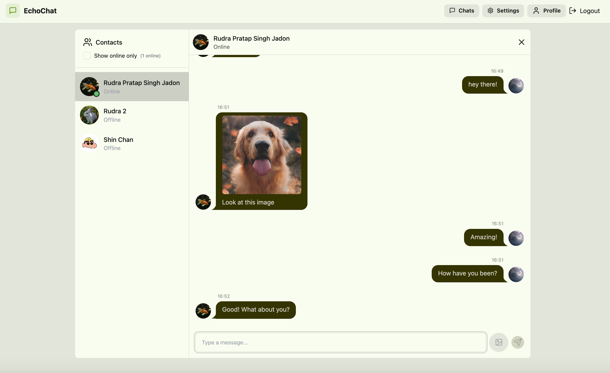

# EchoChat

**EchoChat** is a real-time chat application built with the MERN stack, designed for seamless and responsive communication. It offers secure messaging, live online status, image sharing, profile customization, theming, and more—making it a complete modern chat solution.

---

## Deployment

The application is deployed and accessible online.  
Check it out here: [https://echochat-75x2.onrender.com](https://echochat-75x2.onrender.com)

---

## Screenshots

- Signup Page 
  
  
  
- Login Page
  
  

- Home Chat Interface
  
  

- Profile Page
  
  

- Settings / Theme Switcher
  
  

---

## Features

### Authentication

- **Signup/Login with JWT** – Secure authentication using HTTP-only cookies
- **Session Persistence** – Automatically stays logged in on page refresh

### Real-Time Messaging

- **One-on-One Chat** – Instant messaging using Socket.IO
- **Live Online Status** – See who is online in real time
- **Image Sharing** – Send and receive images in chat
- **Auto Scroll** – Chat view automatically scrolls to the latest message

### User Profiles

- **View & Edit Profile** – Access user profile with name, email, and avatar
- **Profile Picture Upload** – Upload or change profile pictures using Cloudinary

### Custom Themes

- **30+ Themes with DaisyUI** – Easily switch between light, dark, and colorful themes
- **Theme Persistence** – User theme preferences are saved across sessions

### User Experience

- **Responsive Design** – Fully responsive across desktop and mobile
- **Loading States & Feedback** – Smooth UX with spinners, skeletons, and toast notifications

### Chat Management

- **Sidebar User List** – View and filter available users
- **Online-Only Toggle** – Focus only on users currently online
- **Chat Header Info** – Displays selected user's name, avatar, and status

---

## Tech Stacks

### Frontend

- React
- Vite
- TailwindCSS
- DaisyUI
- Zustand
- Axios
- Socket.IO Client
- React Router DOM

### Backend

- Node.js
- Express.js
- MongoDB + Mongoose
- Socket.IO
- JWT for authentication
- Cloudinary for image uploads

  
